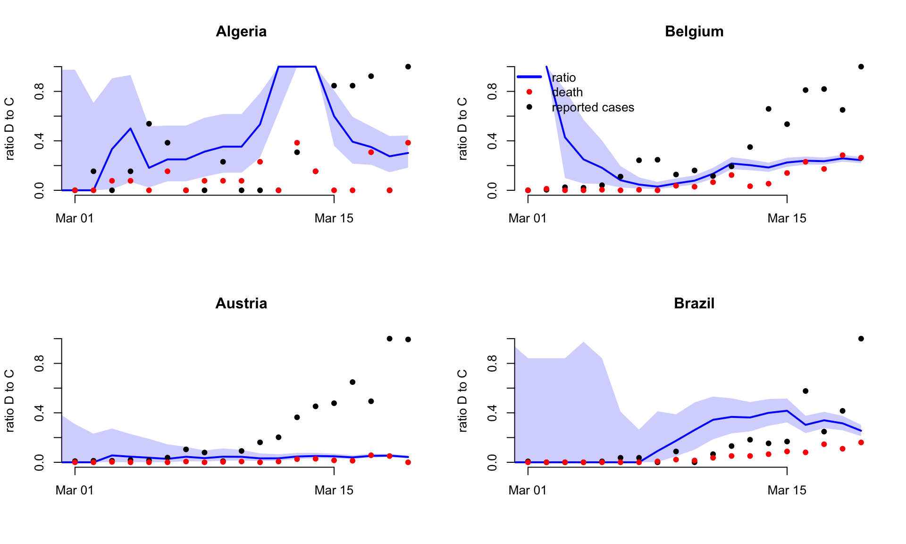
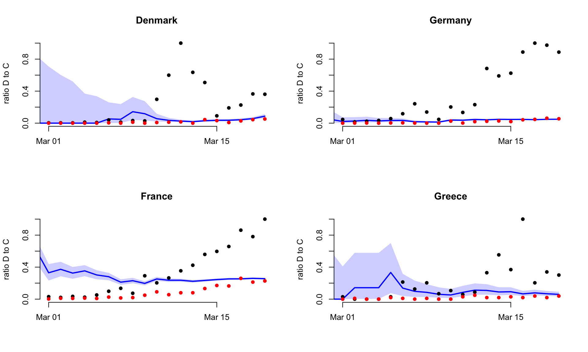
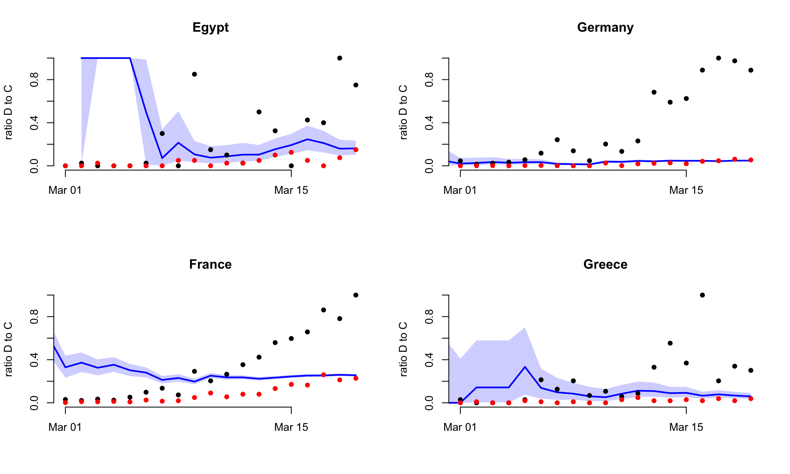
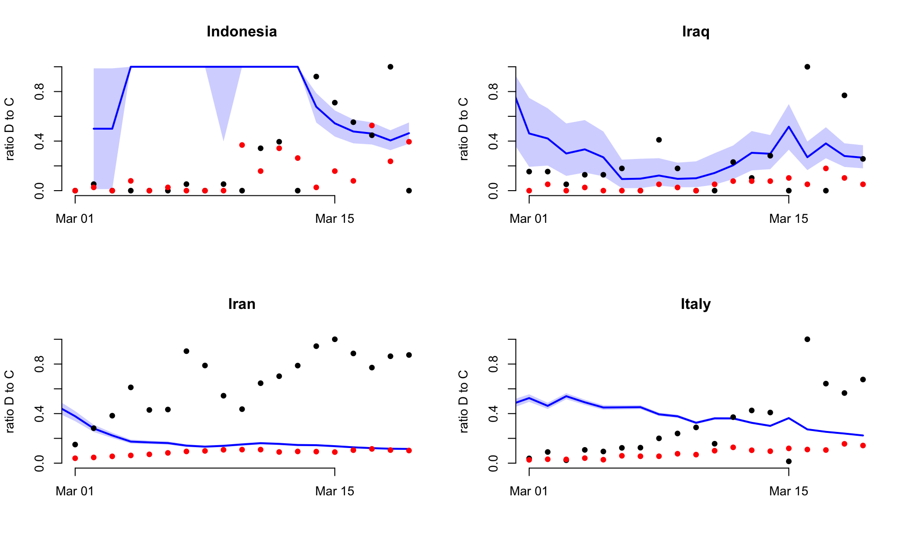
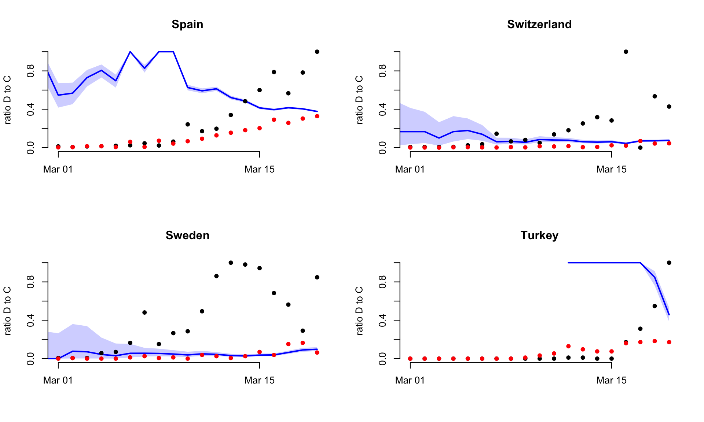
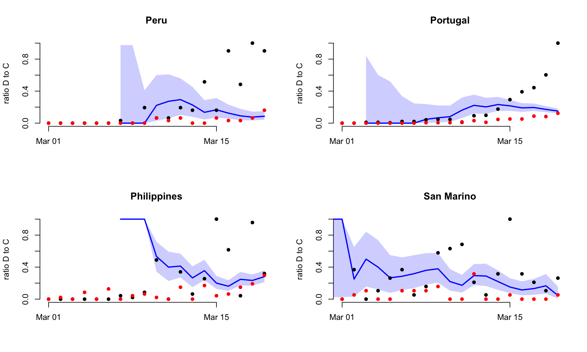
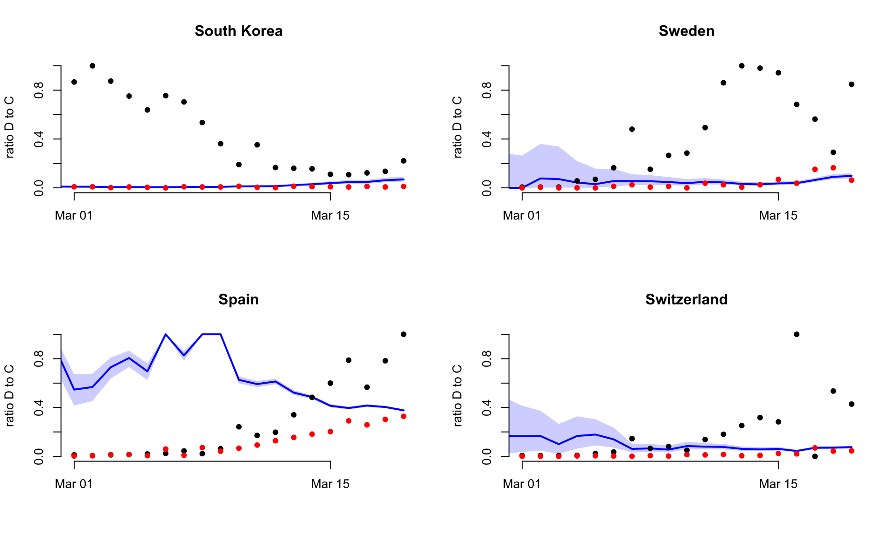
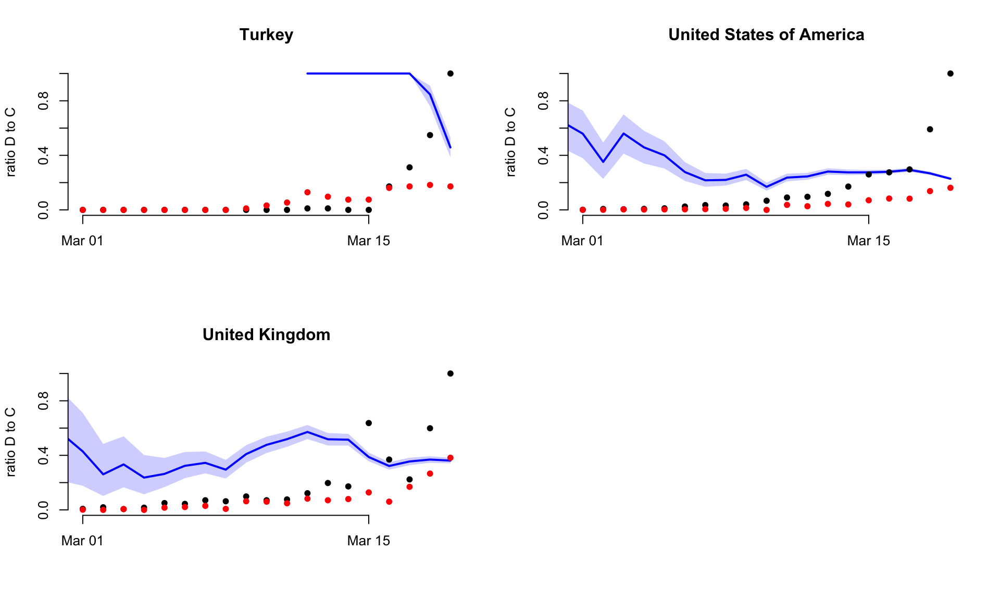

```{r echo = FALSE, warning = FALSE, message = FALSE}
library(ggplot2)
library(ggpubr)
library(dplyr)
library(drake)
library(kableExtra)
library(DT)
source("R/util.R")
source("params.R")
knitr::opts_chunk$set(
    echo = FALSE, 
    fig.width = 21, 
    fig.height = 15,
    warning = FALSE,
    messages = FALSE
)
```
# Introduction {.tabset .tabset-fade .tabset-pills}

As of `r format(Sys.time(), '%B %d, %Y')`, there have more than
650,000 cases of COVID-19 across the world, with more than 33,000
deaths [@whositrep] . In this report, we use the reported number of deaths
of COVID-19 to make short term forecasts of the trajectory of the
epidemic and the expected number of
COVID-19 deaths for 21 countries with sustained human-to-human
transmission. We also estimate case ascertainment in each country to
look at reporting trends over time.


## Summary

### Objectives and caveats

The **main** objective in this report is to produce forecasts of the 
number of deaths in the week ahead for each country with active transmission.

* We define a country to have sustained local active transmission if
at least five deaths were observed in the country in two previous
consecutive weeks. In the analysis for week beginning 
22^nd^ March 2020, 14 countries/regions were included in the analysis
based on these thresholds. For the week beginning 29^th^ March 2020,
the number of countries/regions included is 31.


* We forecast the number of potential deaths as the reporting of deaths
is likely to be more reliable and stable over time than the reporting 
of cases. 

* As we are forecasting deaths, latest estimates of
transmissibility reflect the epidemiological situation at the time of
the infection of COVID-19 fatalities. Therefore, in the best case scenario, the
impact of current controls on estimated transmissibility will be
quantifiable with a delay (i.e. delay between reporting and death).


A **secondary** objective of this report is to analyse case
ascertainment per country. As well as forecasting ahead, we use the number
of reported deaths and of cases reported 10 days prior (using a fixed
delay) to analyse the reporting trends per
country. If the reporting of cases and deaths was perfect, and
the delay between reporting and death fixed and known, the ratio of
deaths to delayed cases equal Case Fatality Ratio (CFR).

In this analysis, key assumptions are:

* The true underlying CFR is 1%,
* The delay from a case being reported to death is 10 days.
* All deaths due to COVID-19 have been reported in each country.

```{r child = "dynamic-summary.Rmd"}
```


```{r echo = FALSE, warning = FALSE, message = FALSE}

ensb_pred <- drake::readd("ensemble_model_qntls")
ensb_pred <- na.omit(ensb_pred)
## We only need the projections before the most recent one.
pass <- drake::readd("pass")
pass$DateRep <- as.Date(pass$DateRep)
ensb_pred$date <- as.Date(ensb_pred$date)
x <- dplyr::left_join(
    ensb_pred,
    pass,
    by = c("date" = "DateRep",
           "country" = "Countries.and.territories")
    ) %>% na.omit()
x <- x[x$si == "si_1", ]
propinci <- assessr:::prop_in_ci(
    x$Deaths, x$`2.5%`, x$`97.5%`
)

```
Model performance in predicting ahead was good in previous weeks  with 
`r scales::percent(propinci, accuracy = 0.1)` of the observed number
of deaths across all countries included in the 95% Credible Interval (CrI) of the forecast
intervals.

### Key results on case ascertainment

Case ascertainment was estimated based on the deaths in the previous 2 weeks  and 
reported cases in the 10 days prior to that period.  Estimates of case
ascertainment were highly variable.
Results indicate that countries with highest case ascertainment were:
  
* Norway with an estimated median ascertainment of 71.9% (95% CrI 46.3% - 100.0%), and
* South Korea with an estimated median ascertainment of 36.4% (95% CrI 29.2% - 45.9%);

and countries with the lowest case ascertainment were:

* Indonesia with an estimated median ascertainment of: 1.7% (95% CrI 1.5% -
  2.0%), and
* Turkey with an estimated median ascertainment of 1.8% (95% CrI 1.6% - 2.0%).


Based on the estimated ascertainment, we estimated the true size of
the epidemic in each country in the previous 7 days (week starting 22-03-2020). 
Countries with the largest true epidemic size in this period were:
  
* United States of America with an estimated true epidemics size in this period of
  2,200,000 (95% CrI 1,300,000 - 2,100,000), and
* Spain with an estimated true epidemic size in this period of
1,900,000 (95% CrI 1,900,000 - 1,900,000).

and countries with the lowest true epidemic size in this period were:

* San Marino with an estimated true epidemic size in this period of
1,300 (95% CrI 790 - 1,900), and 
* South Korea with an estimated true epidemic size in this period of
  1,800 (95% CrI 1,400 - 2,300).


<br>
<br>

## Methods

We define a country to have sustained local active transmission if
at least five deaths were observed in the country in the last two
consecutive weeks. We intend to produce forecasts every
week, for the
week ahead. Two different modelling teams will produce these
forecasts which are then used to produce an ensemble forecast.

Our main analysis assumes a gamma distributed serial interval with mean 4.8 days
and standard deviation of 2.7 days following Wang and Teunis, 2020.
The serial interval estimates observed from various studies thus far
may be biased toward lower values due to observation bias whereby, in
contact tracing studies, long serial
intervals tend to be under-represented. To account for this, as a
sensitivity analysis, we also use a
longer serial interval of mean 6.48 days and standard deviation of
3.83 days [Ferguson 2020, Report 9]. Results for this longer interval
are presented in the section Sensitivity Analyses. While using such a
longer serial interval has very little
impact on the weekly forecasts produced, it results in much higher
estimates of transmissibility.

```{r}
sicaption <- "The results presented in this report use a Serial Interval distribution with a mean of 4.80 days and a standard deviation of 2.70 days (shown in purple). We use a longer Serial interval with a mean of 6.48 days and a stamdard deviation of 3.83 days (shown here in green) to perform sensitivity analyses."
```

```{r echo = FALSE, warning = FALSE, message = FALSE, fig.cap = sicaption}

short <- EpiEstim::discr_si(0:30, 4.8, 2.7)
long <- EpiEstim::discr_si(0:30, 6.48, 3.83)
df <- data.frame(
    x = c(0:30, 0:30),
    cat = c(rep("short", 31), rep("long", 31)),
    val = c(short, long)
)

ggplot(df, aes(x, val, fill = cat)) +
    geom_col(position = "dodge") +
    theme_pubr() +
    theme(
        legend.title = element_blank(),
        axis.title.y = element_text(size = 20),
        axis.text = element_text(size = 20),
        legend.text = element_text(size = 20)
    ) +
    xlab("Days") +
    ylab("Probability") +
    scale_fill_manual(
        values = c(short = "#b067a3", long = "#9c954d"),
        breaks = c("short", "long"),
        labels = c("Short SI (mean 4.80, sd 2.70)",
                   "Long SI (mean 6.48, sd 3.83)")
        )
    
```

<br><br>


## Projections and Rt Estimates {.tabset .tabset-fade .tabset-pills} 

### Ensemble Model {.tabset .tabset-fade .tabset-pills} 

#### Methods

This is an unweighted ensemble of Models 1 and 2.

#### Projections

**Current and past forecasts**

Below for each country with active transmission (see methods), we plot
the observed incidence of deaths in the last 3 weeks (black
dots). Past forecasts, where available, are shown in green (median and
95% CrI interval), while latest forecasts are show in red. Vertical
dashed line show the start and end of each week (Monday to Sunday).


```{r echo = FALSE, warning = FALSE, message = FALSE}

obs <- drake::readd("obs")
ensb_pred <- drake::readd("ensemble_model_qntls")
ensb_pred1 <- ensb_pred[ensb_pred$si == "si_1", ]
ensb_pred1$date <- as.Date(ensb_pred1$date)
nice_names <- snakecase::to_any_case(
        ensb_pred1$country,
        "title"
    )
names(nice_names) <- ensb_pred1$country

```

```{r}
projection_plot(obs, ensb_pred1) +
    ggforce::facet_wrap_paginate(
            ~country,
            scales = "free_y",
            labeller = as_labeller(
                nice_names
            ),
            ncol = 2,
            nrow = 5,
            page = 1
        ) 

```

```{r}
projection_plot(obs, ensb_pred1) +
            ggforce::facet_wrap_paginate(
            ~country,
            scales = "free_y",
            labeller = as_labeller(
                nice_names
            ),
            ncol = 2,
            nrow = 5,
            page = 2
        ) 

```


```{r}
projection_plot(obs, ensb_pred1) +
            ggforce::facet_wrap_paginate(
            ~country,
            scales = "free_y",
            labeller = as_labeller(
                nice_names
            ),
            ncol = 2,
            nrow = 6,
            page = 3
        ) 

```
<br><br>

#### Estimates of the Effective Reproduction Number

Below are estimates of effective reproduction numbers by country
(median and 95% CrI).

```{r echo = FALSE, warning = FALSE, message = FALSE}

ens_rt_both <- drake::readd("ensemble_model_rt")
ens_rt <- ens_rt_both[ens_rt_both$si == "si_1", ]
ens_rt$model <- as.Date(ens_rt$model)
ens_rt <- ens_rt[ens_rt$model == max(ens_rt$model), ]
model_rt <- drake::readd("model_rt_qntls")
model_rt <- model_rt[grep(
    pattern = max(ens_rt$model), names(model_rt)
)]
model_rt <- dplyr::bind_rows(model_rt, .id = "model")
model_rt <- model_rt[model_rt$si == "si_1", ]
## re-arrange columns so that we can rbind.
model_rt <- model_rt[ , colnames(ens_rt)]
ens_rt <- rbind(model_rt, ens_rt)
ens_rt <- tidyr::spread(ens_rt, quantile, out2)
palette <- c("#E69F00", "#0072B2", "#D55E00")
names(palette) <- unique(ens_rt$model)

rt_plot(ens_rt) +
    scale_color_manual(
        values = palette,
        labels = c("Ensemble", "Model 1", "Model 2")
    ) + theme(
            legend.position = "bottom",
            legend.title = element_blank(),
            legend.text = element_text(size = 20)
        )


```

<br><br>

#### Summary of results

The table below presents the the observed
(where available) and forecasted weekly death counts, and estimated
levels of transmissibility for each country with active transmission
(see methods) and for each period for which forecasts were produced.


```{r echo = FALSE, warning = FALSE, message = FALSE}

x <- drake::readd("fmtd_ensemble_weekly_qntls")[[1]]

## knitr::kable(
##     x,
##     align = "l",
##     digits = 2
## ) %>% kable_styling()

DT::datatable(x)

```

<br><br>

### Model 1 {.tabset .tabset-fade .tabset-pills} 

#### Methods

**Estimating current transmissibility**

The methods is very similar to that of Model 2 but given uncertainty
surrounding the epidemiological situation before the calibration
period, we only used incidence data during the calibration period, and
reconstructed the incidence before the calibration period whilst
estimating R, as described in [@nouvellet2018simple]. The model has
the advantage of being more robust to changes in reporting before the
calibration period.


**Forward projections**

We used the renewal equation [@fraser2007estimating] to project the incidence
forward, given a back-calculated early incidence curve, an estimated
reproduction number, and the observed incidence over the calibration
period. We sampled sets of back-calculated early incidence curves
and reproduction numbers from the posterior distribution obtained in
the estimation process. For each of these sets, we simulate
stochastic realisations of the renewal equation from the end of the
calibration period leading to projected incidence trajectories. 


Projections were made on a 7-days horizon. 
The transmissibility is assumed to remain constant over this time
period. 
If transmissibility were to decrease as a result of control interventions
and/or changes in behaviour over this time period, we would predict 
fewer cases; similarly, if transmissibility were to increase
over this time period, we would predict more cases. We
limited our projection to 7 days only as assuming constant
transmissibility over longer time horizons seemed unrealistic in light
of the different interventions implemented by different countries and
potential voluntary behavior changes.


 
#### Projections 

**Current and past forecasts**

Below for each country with active transmission (see methods), we plot
the observed incidence of deaths in the last 3 weeks (black
dots). Past forecasts, where available, are shown in green (median and
95%CrI band), while latest forecasts are show in red. Horizontal
dashed lines show the start and end of each week (Monday to Sunday).


```{r echo = FALSE, warning = FALSE, message = FALSE}
obs <- drake::readd("obs")
pred <- drake::readd("model_1")
pred <- pred[pred$si == "si_1", ]
pred$date <- as.Date(pred$date)


```

```{r}
projection_plot(obs, pred) +
    ggforce::facet_wrap_paginate(
            ~country,
            scales = "free_y",
            labeller = as_labeller(
                nice_names
            ),
            ncol = 2,
            nrow = 5,
            page = 1
        ) 

```


```{r}
projection_plot(obs, pred) +
    ggforce::facet_wrap_paginate(
            ~country,
            scales = "free_y",
            labeller = as_labeller(
                nice_names
            ),
            ncol = 2,
            nrow = 5,
            page = 2
        ) 

```


```{r}
projection_plot(obs, pred) +
    ggforce::facet_wrap_paginate(
            ~country,
            scales = "free_y",
            labeller = as_labeller(
                nice_names
            ),
            ncol = 2,
            nrow = 6,
            page = 3
        ) 

```


<br><br>

#### Estimates of the Effective Reproduction Number 

In the figure below, for each country with active transmission (see
methods), we plot the latest estimates (median and 95% CrI) of transmissibility ($R_t$),
for week ending 29-03-2020.


```{r echo = FALSE, warning = FALSE, message = FALSE}
rt <- drake::readd("model_1_rt")
rt <- rt[rt$si == "si_1", ]
rt <- rt[rt$proj == "RtI0_Std_results_week_end_2020-03-29", ]
rt$model <- rt$proj
rt_plot(rt)

```

<br><br>

#### Summary of results

The table below summarizes for each country with active transmission
(see methods), and for each period for which forecasts were produced, 
the observed (where
available) and forecasted weekly death count, and estimated level of
transmissibility.

```{r echo = FALSE, warning = FALSE, message = FALSE}

x <- drake::readd("formatted_weekly_predictions_qntls")[[1]]
x <- x[grep("RtI0", x$model), ]
x <- dplyr::select(x, -model)
DT::datatable(x)

```

<br><br>


### Model 2 {.tabset .tabset-fade .tabset-pills} 

#### Methods

**Estimating current transmissibility**

The standard approach to inferring the effective reproduction number at
t, R~t~, from an incidence curve (with cases at t denoted I~t~) is
provided by [@cori2013new]. This method assumes that
R~t~ is constant over a window back in time of size *k* units (e.g. days
or weeks) and uses the part of the incidence curve contained in this
window to estimate R~t~. However, estimates of $R_t$ can depend strongly on
the width of the time-window used for estimation. Thus
mis-specified time-windows can bias our inference. In [@parag2019optimising]
we use information theory to extend the approach of Cori et al. to optimize
the choice of the time-window and refine estimates of $R_t$. 
Specifically:

-   We integrate over the entire posterior distribution of R~t~, to
    obtain the posterior predictive distribution of incidence at time
    t+1 as P(I~t+1~ \| I~1~^t^) with I~1~^t^ as the incidence curve up
    to t. For a gamma posterior over R~t~ this is analytic and negative
    binomial ([see @parag2019optimising] for exact formulae). 
	
-   We compute this distribution sequentially and casually across the
    existing incidence curve and then evaluate every observed case-count
    according to this posterior predictive distribution. For example at
    t = 5, we pick the true incidence value I~5~\* and evaluate the
    probability of seeing this value under the predictive distribution
    i.e. P(I~5~ = I~5~\* \| I~1~^4^).

This allows us to construct the accumulated predictive error (APE) under
some window length *k* and under a given generation time distribution
as:

$$\text{AP}E_{k} = \sum_{t = 0}^{T - 1}{- \log{P\left( I_{t + 1} = I_{t + 1}^{*}\  \right|\ I_{t - k + 1}^{t})\ \ }}$$

The optimal window length *k\** is then
$k^{*} = \arg{\min_{k}{\text{AP}E_{k}}}$.  Here
*T* is the last time point in the existing incidence curve.

**Forward Projections**

Forward projections are made assuming that the transmissibility
remains unchanged over the projection horizon and same as the transmissibility
in the last time-window.  The projections are made using the standard
branching process model using a Poisson offspring distribution. 


#### Projections

**Current and past forecasts**

Below for each country with active transmission (see methods), we plot
the observed incidence of deaths in the last 3 weeks (black
dots). Past forecasts, where available, are shown in green (median and
95%CrI band), while latest forecasts are show in red. Horizontal
dashed lines show the start and end of each week (Monday to Sunday).


```{r echo = FALSE, warning = FALSE, message = FALSE}
pred <- drake::readd("model_2") 
pred <- pred[pred$si == "si_1", ]
pred$date <- as.Date(pred$date)

```

```{r}
projection_plot(obs, pred) +
    ggforce::facet_wrap_paginate(
            ~country,
            scales = "free_y",
            labeller = as_labeller(
                nice_names
            ),
            ncol = 2,
            nrow = 5,
            page = 1
        ) 

```


```{r}
projection_plot(obs, pred) +
    ggforce::facet_wrap_paginate(
            ~country,
            scales = "free_y",
            labeller = as_labeller(
                nice_names
            ),
            ncol = 2,
            nrow = 5,
            page = 2
        ) 

```


```{r}
projection_plot(obs, pred) +
    ggforce::facet_wrap_paginate(
            ~country,
            scales = "free_y",
            labeller = as_labeller(
                nice_names
            ),
            ncol = 2,
            nrow = 6,
            page = 3
        ) 

```
<br><br>

#### Effective Reproduction Number Estimates

In the figure below, for each country with active transmission (see
methods), we plot the latest estimates (median and associated 95% CrI) 
of transmissibility ($R_t$) for the week ending 29-03-2020.


```{r echo = FALSE, warning = FALSE, message = FALSE}

rt <- drake::readd("model_2_rt")
rt <- rt[rt$si == "si_1", ]
rt <- rt[rt$proj == "sbkp_Std_results_week_end_2020-03-29", ]
rt$model <- rt$proj
rt_plot(rt)

```

<br><br>

#### Summary of results

The table below summarizes for each country with active transmission
(see methods), and for each period for which forecasts were produced, 
the observed (where
available) and forecasted weekly death count, and estimated level of
transmissibility.


```{r echo = FALSE, warning = FALSE, message = FALSE}

x <- drake::readd("formatted_weekly_predictions_qntls")[[1]]
x <- x[grep("sbkp", x$model), ]
x <- dplyr::select(x, -model)
DT::datatable(x)

```

<br><br>


## Sensitivity Analyses {.tabset .tabset-fade .tabset-pills} 


Results below use a longer serial interval distribution (mean 6.48
days, SD 3.83 days). Only results from the ensemble model are
presented here.


### Projections

Below for each country with active transmission (see methods), we plot
the observed incidence of deaths in the last 3 weeks (black
dots). Past forecasts, where available, are shown in green (median and
95%CrI band), while latest forecasts are show in red. Horizontal
dashed line show the start and end of each week (Monday to Sunday).


```{r echo = FALSE, warning = FALSE, message = FALSE}

ensb_pred2 <- ensb_pred[ensb_pred$si == "si_2", ]
ensb_pred2$date <- as.Date(ensb_pred2$date)


```


```{r}
projection_plot(obs, ensb_pred2) +
    ggforce::facet_wrap_paginate(
            ~country,
            scales = "free_y",
            labeller = as_labeller(
                nice_names
            ),
            ncol = 2,
            nrow = 5,
            page = 1
        ) 

```


```{r}
projection_plot(obs, ensb_pred2) +
    ggforce::facet_wrap_paginate(
            ~country,
            scales = "free_y",
            labeller = as_labeller(
                nice_names
            ),
            ncol = 2,
            nrow = 5,
            page = 2
        ) 

```


```{r}
projection_plot(obs, ensb_pred2) +
    ggforce::facet_wrap_paginate(
            ~country,
            scales = "free_y",
            labeller = as_labeller(
                nice_names
            ),
            ncol = 2,
            nrow = 6,
            page = 3
        ) 

```


<br><br>


### Effective Reproduction Number Estimates

In the figure below, for each country with active transmission (see
methods), we plot the latest estimate (median and associated 95% CrI) 
of transmissibility ($R_t$) for week ending 29-03-2020.


```{r echo = FALSE, warning = FALSE, message = FALSE}


ens_rt <- ens_rt_both[ens_rt_both$si == "si_2", ]
ens_rt$model <- as.Date(ens_rt$model)
ens_rt <- ens_rt[ens_rt$model == max(ens_rt$model), ]

model_rt <- drake::readd("model_rt_qntls")
model_rt <- model_rt[grep(
    pattern = max(ens_rt$model), names(model_rt)
)]
model_rt <- dplyr::bind_rows(model_rt, .id = "model")
model_rt <- model_rt[model_rt$si == "si_2", ]
## re-arrange columns so that we can rbind.
model_rt <- model_rt[ , colnames(ens_rt)]
ens_rt <- rbind(model_rt, ens_rt)
ens_rt <- tidyr::spread(ens_rt, quantile, out2)

palette <- c("#E69F00", "#0072B2", "#D55E00")
names(palette) <- unique(ens_rt$model)

rt_plot(ens_rt) +
    scale_color_manual(
        values = palette,
        labels = c("Ensemble", "Model 1", "Model 2")
    ) + theme(
            legend.position = "bottom",
            legend.title = element_blank(),
            legend.text = element_text(size = 20)
        )


```


<br><br>


## Case Ascertainment

The analysis relies on the following assumptions:
  
* The true underlying Case Fatality Ratio (CFR) is 1%,
* The delay from case being reported to death is 10 days.
* All deaths due to COVID-19 have been reported in each country.

First, we analyses the ratio of reported deaths to cases reported 10 days prior.
This ratio roughly accounts for the delay between deaths and cases being reported. 

Any temporal trend suggests a change in reporting of COVID-19. 
For instance, an increase in the ratio indicates that cases
reporting is decreasing, while a decrease in the ratio indicates that
the reporting in increasing. It is worth noting that the surveillance
for a novel pathogen is likely to be quite variable over time,
particularly at the beginning of an outbreak before
stabilizing.


**Temporal trend in the ratio of deaths to reported cases**

Starting in March, we compute the average and 95% CI for the ratio of
deaths  to reported cases (with a 10-days delay) using a moving window
of 7 days.
The figure below shows the temporal trends in the ratio of reported
deaths to reported cases 10 days prior (medians and 95% CIs, solid
lines and bands respectively).
We also plot both the reported deaths (red) and reported cases
(black). 
The reported number of deaths and cases have
been rescaled so
that the maximium recorded numbers of deaths or cases (with a 10-days
delay) reaches 1.


```{r echo = FALSE, warning = FALSE, message = FALSE}

```


```{r echo = FALSE, warning = FALSE, message = FALSE}

```


```{r echo = FALSE, warning = FALSE, message = FALSE}

```


```{r echo = FALSE, warning = FALSE, message = FALSE}

```


```{r echo = FALSE, warning = FALSE, message = FALSE}

```


```{r echo = FALSE, warning = FALSE, message = FALSE}

```


```{r echo = FALSE, warning = FALSE, message = FALSE}

```


```{r echo = FALSE, warning = FALSE, message = FALSE}

```


*Note that if deaths exceed the number of reported cases 10-days before, we set the ratio at 1 (95%CI [1;1])*

**Estimating ascertainment**

If all cases (including asymptomatic cases) and deaths were reported,
and the delay from reporting to death was exactly 10 days, then the
ratio defined above would be equivalent to the Case Fatality Ratio
(CFR).


Assuming a CFR of 1%, the ascertainment, $\rho$, can be defined as:
$$\rho = \frac{I^r}{D^r} CFR$$
with $D^r$ and $I^r$ the reported number of deaths and cases (with a 10-days delay).

And the ratio previously defined is 
$$\frac{D^r}{I^r}$$

Below we summarise the:

* Estimated ratio of deaths per delayed reported cases per country
  (mean and 95% CI) during the last 14 days, 
* Estimated case ascertainment per country (mean and 95% CI) during the last 14 days,
* Estimated factor to be multiplied to observed cases number to obtain
  the true number of cases (scaling factor * observed cases). 
  Mean and 95% CI, estimated for the last 14 days.
* Observed and predicted number of cases in the last week (week starting [date]).

Average and 95% CI for the ratio of deaths to reported cases for the last 14 days.

```{r echo = FALSE, warning = FALSE, message = FALSE}
x <- readr::read_csv(here::here("Team.output/summary_DeathToRepoted_14days_2020-03-29.csv"))
## knitr::kable(x[, -1]) %>%
##     kable_styling() 
DT::datatable(x[, -1]) 
```


## References

The forecasts produced use the reported daily counts of deaths per country available on the ECDC website:

https://www.ecdc.europa.eu/en/publications-data/download-todays-data-geographic-distribution-covid-19-cases-worldwide


 
